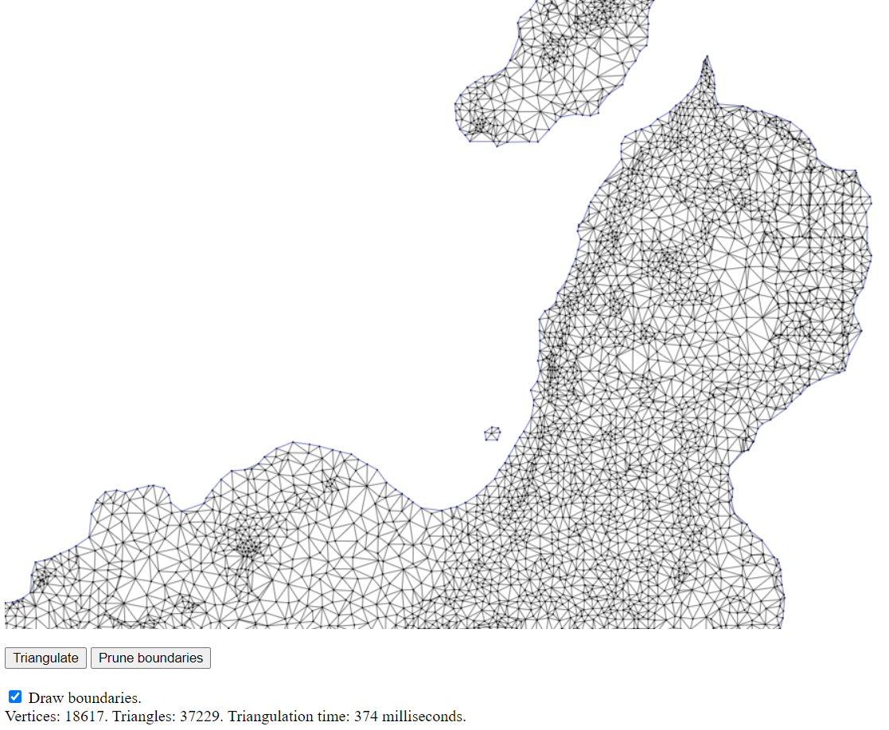

# Computational geometry Labs
This repository contains the lab implementations of the Q1 2020-2021 Computational Geometry course (GEOC).   
Lab 4 uses a hierarchical tree data structure to find the triangle where a new point falls efficiently, while Lab 5 uses an auxiliary point.

*Delaunay triangulation with prunned boundaries of the Lanzarote data (Lab 5)*: 
